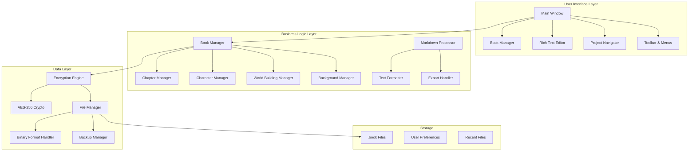
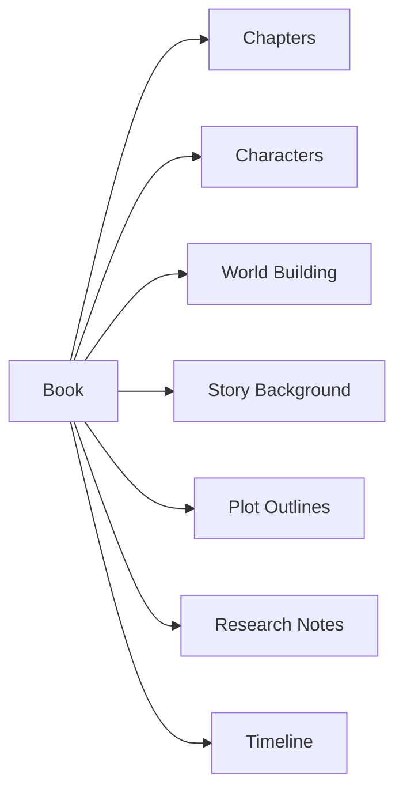
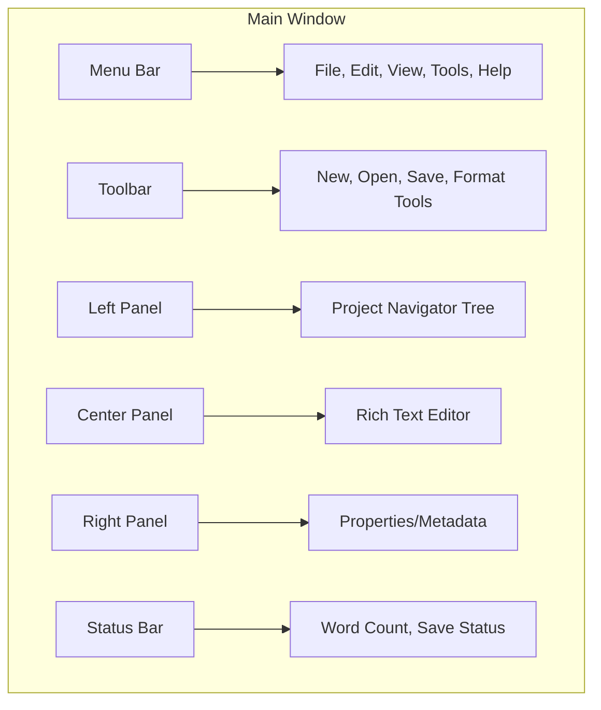
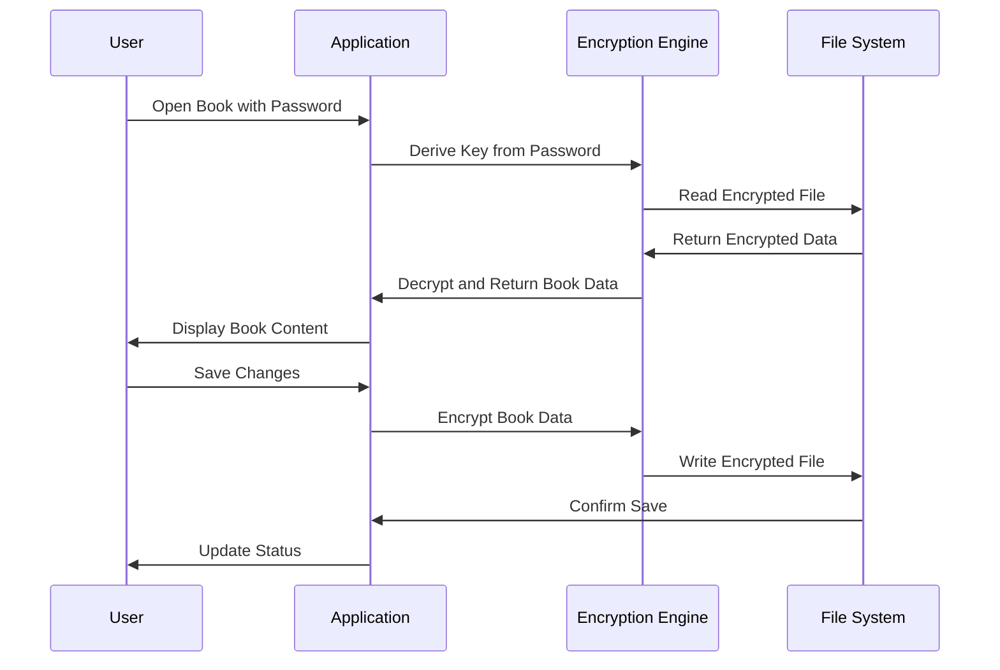

# BookWriter - Windows Desktop Application Design Plan

## 🎯 Project Overview
A professional Windows desktop application for book writing with markdown support, built using Python and PyQt6. The software organizes content by books, with chapters and writing elements, featuring strong AES-256 encryption for data protection.

## 🏗️ System Architecture



## 📋 Core Features

### 1. Book Management System
- **Book Creation**: New book wizard with metadata (title, author, genre, etc.)
- **Book Opening**: Password-protected book files (.book extension)
- **Book Structure**: Hierarchical organization of writing elements
- **Password Management**: Change password functionality for existing books

### 2. Writing Elements Organization


### 3. Rich Text Editor Features
- **Markdown Support**: Live markdown rendering with shortcuts
- **Formatting Toolbar**: Bold, italic, headers, lists, links, images
- **Keyboard Shortcuts**: Standard markdown shortcuts (Ctrl+B, Ctrl+I, etc.)
- **Auto-save**: Continuous saving to prevent data loss
- **Word Count**: Real-time statistics
- **Find & Replace**: Advanced search functionality

### 4. Security Features
- **AES-256 Encryption**: Military-grade encryption for book files
- **Password Protection**: Required password to open books
- **Secure Storage**: All data encrypted at rest
- **Password Change**: Ability to update book passwords
- **Session Management**: Auto-lock after inactivity

## 🔧 Technical Implementation

### Technology Stack
- **Framework**: PyQt6 for GUI
- **Language**: Python 3.9+
- **Encryption**: `cryptography` library (AES-256-GCM)
- **Markdown**: `markdown` library with extensions
- **Text Processing**: `python-markdown` with syntax highlighting
- **File Format**: Custom binary format with JSON structure

### Project Structure
```
bookwriter/
├── main.py                 # Application entry point
├── ui/
│   ├── main_window.py     # Main application window
│   ├── book_manager.py    # Book creation/opening dialogs
│   ├── editor_widget.py   # Rich text editor component
│   ├── navigator.py       # Project navigation tree
│   └── dialogs/           # Various dialog windows
├── core/
│   ├── book.py           # Book data model
│   ├── chapter.py        # Chapter management
│   ├── character.py      # Character profiles
│   ├── encryption.py     # AES encryption handler
│   └── file_manager.py   # File I/O operations
├── utils/
│   ├── markdown_processor.py  # Markdown rendering
│   ├── shortcuts.py           # Keyboard shortcuts
│   └── validators.py          # Input validation
├── resources/
│   ├── icons/            # Application icons
│   ├── styles/           # QSS stylesheets
│   └── templates/        # Document templates
└── requirements.txt      # Python dependencies
```

### Data Model
```mermaid
classDiagram
    class Book {
        +string title
        +string author
        +string genre
        +datetime created
        +datetime modified
        +list chapters
        +list characters
        +dict metadata
        +encrypt()
        +decrypt()
        +change_password()
    }
    
    class Chapter {
        +string title
        +string content
        +int order
        +datetime modified
        +int word_count
        +save()
        +export_markdown()
    }
    
    class Character {
        +string name
        +string description
        +string background
        +dict attributes
        +string image_path
    }
    
    class WorldBuilding {
        +string name
        +string description
        +dict locations
        +dict rules
        +dict history
    }
    
    Book ||--o{ Chapter
    Book ||--o{ Character
    Book ||--o{ WorldBuilding
```

## 🎨 User Interface Design

### Main Window Layout


### Key UI Components
1. **Project Navigator**: Tree view showing book structure
2. **Rich Text Editor**: Main editing area with markdown toolbar
3. **Properties Panel**: Metadata and character/world building details
4. **Quick Access Toolbar**: Common formatting and file operations
5. **Status Information**: Word count, save status, encryption indicator

## 🔐 Security Implementation

### Encryption Workflow


## 📦 File Format Specification

### .book File Structure
```
Header (32 bytes):
- Magic Number (4 bytes): "BOOK"
- Version (4 bytes): File format version
- Salt (16 bytes): Random salt for key derivation
- IV (12 bytes): Initialization vector for AES-GCM

Encrypted Payload:
- JSON structure containing all book data
- Compressed using zlib before encryption
- Authenticated with GCM tag
```

## 🚀 Development Phases

### Phase 1: Core Infrastructure (Week 1-2)
- [ ] Project setup and dependencies
- [ ] Basic PyQt6 window structure
- [ ] Encryption engine implementation
- [ ] File format handler
- [ ] Basic book data model

### Phase 2: User Interface (Week 3-4)
- [ ] Main window layout
- [ ] Project navigator tree
- [ ] Rich text editor widget
- [ ] Toolbar and menus
- [ ] Dialog windows

### Phase 3: Writing Features (Week 5-6)
- [ ] Markdown processing
- [ ] Text formatting tools
- [ ] Auto-save functionality
- [ ] Find and replace
- [ ] Export capabilities

### Phase 4: Advanced Features (Week 7-8)
- [ ] Character management
- [ ] World building tools
- [ ] Timeline features
- [ ] Backup and recovery
- [ ] User preferences

### Phase 5: Testing & Polish (Week 9-10)
- [ ] Comprehensive testing
- [ ] Performance optimization
- [ ] UI/UX improvements
- [ ] Documentation
- [ ] Installer creation

## 📋 Required Dependencies
```
PyQt6>=6.4.0
cryptography>=3.4.8
markdown>=3.4.1
Pygments>=2.12.0
python-markdown-math>=0.8
```

## 🎯 Key Success Metrics
- **Security**: All data encrypted with AES-256
- **Usability**: Intuitive interface for writers
- **Performance**: Fast loading and saving of large documents
- **Reliability**: Auto-save and backup features
- **Flexibility**: Extensible architecture for future features

This comprehensive design provides a solid foundation for a professional book writing application with strong security features and user-friendly interface. The modular architecture allows for easy maintenance and future enhancements.